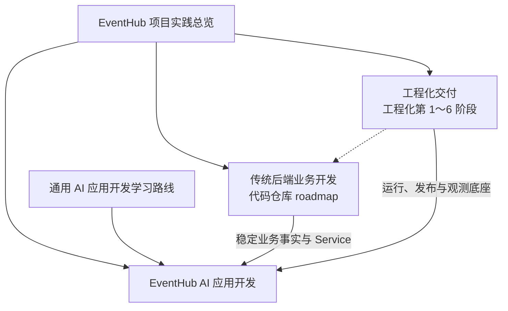

本文是 EventHub Java 与 Go 两个后端项目在知识库中的项目级入口，负责区分业务开发、工程化交付和 AI 应用开发三条相关但不同的实践路线，并说明新笔记应归入哪个层级。

本文只维护路线关系、术语和导航，不复制各路线的阶段细节、技术教程或动态执行结果。

## 项目与事实来源

- Java `eventhub` 项目先验证业务语义和主要实现方案。
- Go `eventhub-go` 项目复刻相同产品语义，但内部实现遵循 Go idiom。
- 传统后端业务阶段以代码仓库中的业务 roadmap、接口契约、迁移和测试为事实来源，知识库不维护第二份容易漂移的业务进度表。
- Linux、Java、Go、Docker、Git、MySQL 和 AI 等跨项目知识继续保存在对应主题目录；`项目实践/EventHub/` 只记录这些能力如何在 EventHub 中组合、落地和验收。

## 三条实践路线

| 路线 | 负责内容 | 主要入口 | 推进方式 |
| --- | --- | --- | --- |
| 传统后端业务开发 | 活动、场次、票种、订单、库存、支付、权限和交易规则 | 两个代码仓库中的业务 roadmap 与测试 | Java 先明确产品语义，Go 做等价复刻 |
| 工程化交付 | 开发环境、原生部署、代理与 TLS、容器化、CI/CD、回滚和可观测性 | [[EventHub 工程化交付路线图]] | 按工程化第 1～6 阶段顺序验收 |
| AI 应用开发 | 内容生成、语义检索、RAG、工具调用、受控 Agent、评测与安全 | [[EventHub AI 应用实践路线图]] | 通用能力可独立学习，项目接入受业务门槛约束 |

三条路线不是同一套阶段编号，也不是简单串行关系：

- 传统业务开发与工程化交付可以并行推进。
- [[AI 应用开发学习路线图]] 中的独立实验不必等待传统业务全部完成。
- AI 能力接入 EventHub 必须等待相应业务对象、权限、事务和幂等边界稳定。
- AI 功能进入可部署状态后，继续复用工程化交付路线的发布、回滚和可观测能力，不建立第二套生产链路。

## 阶段称谓

EventHub 同时存在多套阶段编号。跨笔记引用时必须带上路线限定词：

| 推荐称谓 | 含义 | 不推荐写法 |
| --- | --- | --- |
| 业务阶段 3 | 代码仓库业务 roadmap 中的第三阶段 | 第 3 阶段 |
| 工程化第 1 阶段 | 工程化交付路线中的 Linux 环境与首次构建 | 第 1 阶段 |
| AI 阶段 4 | 通用 AI 学习路线中的 Embedding 与语义检索 | 第 4 阶段 |

目录名称中的 `01` 至 `06` 只表示工程化交付路线内部的先后顺序。`AI 应用开发/` 不编号，也不作为工程化第 7 阶段。

## 内容分层规则

| 层次 | 保存内容 | 不应保存 |
| --- | --- | --- |
| 项目总览 | 多条实践路线的关系、术语、事实来源和导航 | 某条路线的完整阶段设计 |
| 维度路线图 | 单一维度的阶段依赖、进入条件、状态与退出标准 | 通用教程和单次执行结果 |
| 技术知识笔记 | 可跨项目复用的原理、命令、选择依据、验证与排障 | EventHub 当前 SHA、临时资源和单机状态 |
| 项目阶段或能力笔记 | EventHub 的目标、技术组合、项目约束、执行顺序与验收标准 | 密码、令牌、私钥、动态 IP 等秘密或短期事实 |
| 执行记录 | 某次实际版本、资源配置、提交、命令结果和恢复点 | 未经验证的“已完成”结论 |

精确版本和资源配置可以写入项目阶段笔记或执行记录，但必须注明核对日期、事实来源、适用范围和重新核对方法。路线图解释“为什么这样推进”，通用知识笔记解释“如何选择和操作”，项目笔记记录“EventHub 采用什么”，执行记录证明“实际执行结果是什么”。

## 当前入口

| 路线 | 当前状态 | 下一入口 |
| --- | --- | --- |
| 传统后端业务开发 | 两个仓库继续完善核心票务业务 | 回到代码仓库的当前业务 roadmap 与质量门禁 |
| 工程化交付 | 工程化第 1 阶段笔记与准备检查已建立，实机验收待执行 | [[EventHub 工程化第 1 阶段实施概览]] |
| AI 应用开发 | 通用路线与 EventHub 映射已建立，暂不侵入项目代码 | [[EventHub AI 应用实践路线图]] |

后续工程化阶段只在真正开始设计和执行时创建对应目录；AI 能力也只在进入具体实践时创建能力笔记和 `执行记录/`。不预建空目录、占位文件或指向不存在内容的 Wikilink。

## 新内容的归档判断

1. 可跨项目复用的知识，写入对应技术主题目录。
2. 只描述 EventHub 部署、发布、回滚或观测演进的内容，写入 `工程化交付/`。
3. 只描述 EventHub AI 产品能力、业务门槛、评测或安全边界的内容，写入 `AI 应用开发/`。
4. 某次机器、仓库、版本或命令结果，写入所属阶段或能力目录下的 `执行记录/`。
5. 同时影响多条路线的导航和术语，只在本文维护，子路线通过 Wikilink 引用。
