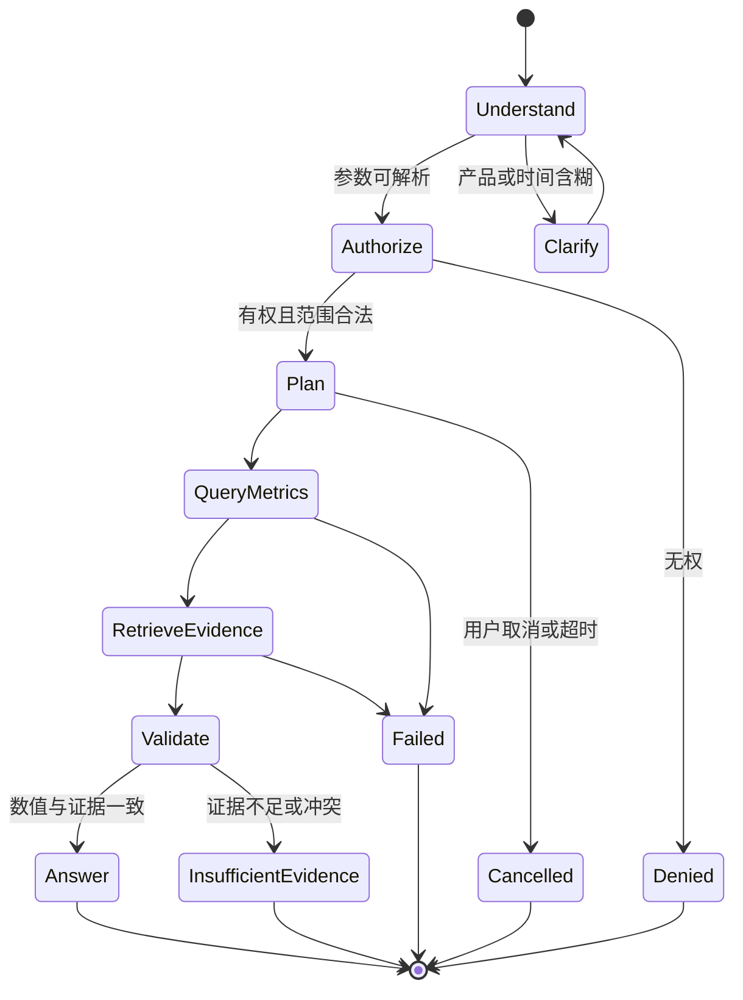

本文把 [[AI 应用开发学习路线图]] 映射到 VoiceInsight，固定 AI 的产品价值、业务门槛、工具边界、评测和安全红线。模型 API、结构化输出、RAG、Tool Calling、MCP 与评测的通用原理继续由 AI 主题笔记维护；本文只记录 VoiceInsight 特有的组合方式。

本设计描述未来能力，不代表 VoiceInsight 已调用任何模型、建立评测集或实现 Agent。

## 核心判断

VoiceInsight 适合使用 AI，但不应从“聊天框”开始。项目中最有价值的 AI 能力按确定性依赖递进：

没有人工标注和分类版本，不做自动分类；没有可评测检索，不做 RAG；没有确定性分析 Service，不开放工具；没有工具、权限和取消证据，不做 Agent。

## AI 与确定性后端的责任

| 问题 | AI 可以负责 | 确定性后端必须负责 |
| --- | --- | --- |
| 反馈分类 | 生成问题、观点和特性候选，指出证据片段，允许弃权 | 分类树版本、允许 ID、业务校验、人工最终决定 |
| 指标分析 | 理解用户意图、选择只读工具、解释结果 | NPS / NSS 公式、过滤、样本量、权限和数值计算 |
| Top 问题 | 把“近两个月”等语言映射成受限参数 | 时区、日期边界、分组、排序、上限和查询执行 |
| 文本检索 | 生成检索查询、归纳候选证据 | 权限过滤、来源版本、索引新鲜度和引用映射 |
| 报告 | 根据确定性证据包撰写草稿和风险提示 | 指标快照、图表、发布状态、审批和通知对象 |
| 告警 | 解释确定性异常并生成摘要 | 阈值、基线、最小样本、去重和触发决定 |
| 权限 | 无 | 身份、角色、产品范围和字段脱敏 |
| 副作用 | 只能提出待确认意图 | 事务、幂等、保存、发布、删除和通知 |

模型永远不是数据库、指标公式、权限或操作结果的权威来源。

## AI 能力 1：结构化反馈分类

### 输入

- 已脱敏的反馈文本和必要上下文。
- 当前产品、产品版本和来源。
- 已允许的问题分类与特性 ID 列表或经过检索缩小的候选集合。
- 分类树、Prompt 和输出 Schema 版本。

来源文本按不可信数据处理，不能拼入 developer message 形成高优先级指令。

### 输出

输出使用严格 JSON Schema，至少包括：

- 一个或多个问题或观点候选。
- 一个或多个已存在的特性 ID。
- 支撑每个候选的原文区间。
- 是否弃权、弃权原因与信息缺口。
- 可选的排序信号，但不把模型自报 `confidence` 当作校准概率。

结构化输出只能约束形状，不能证明业务正确。返回后依次执行 Schema 校验、允许 ID 校验、产品与特性关系校验、证据区间校验和人工策略。

### 人工复核

- 首个版本全部进入复核或按固定比例抽检。
- 人工修改保存为独立事实，不覆盖模型原始候选。
- 每次模型、Prompt、分类树或 Schema 变化都产生新评测版本。
- 未知类别和证据不足必须允许弃权，不能强迫模型在现有分类中猜一个答案。

### Java 与 Go 分工

- Java 创建任务、注入业务版本、保存候选与人工结果，并决定是否可自动接受。
- Go Worker 可以执行高并发批量模型调用，但必须受全局与租户级限流、并发、超时和成本预算控制。
- 两端共享输入、输出 Schema、错误类别和评测集；模型供应商类型不进入共享业务契约。

## AI 能力 2：报告文字草稿

报告生成分为两个不可颠倒的步骤：

1. Java 通过确定性查询生成 `EvidencePack`，包含指标口径、过滤条件、样本量、趋势点、Top 问题、证据标识和数据截止点。
2. 模型只根据 `EvidencePack` 生成结构化文字草稿，所有数值和判断都必须引用包内字段。

模型不得重新计算百分比、补写缺失产品、推测告警原因或选择通知对象。发布报告是单独权限操作，需要人工确认和数据新鲜度复核。

告警同样先由确定性规则触发，例如滚动基线偏离、最小样本量和持续窗口；模型只解释已触发事件。不能把“模型觉得严重”作为告警条件。

## AI 能力 3：检索与 RAG

VoiceInsight 有两类查询，必须分流：

| 查询类型 | 例子 | 正确能力 |
| --- | --- | --- |
| 结构化事实与指标 | 最近两个月某产品 Top 问题、NPS 趋势、来源占比 | 确定性分析工具 |
| 文本证据与解释 | 用户如何描述续航问题、某结论有哪些原始证据 | 权限过滤后的全文或混合检索 + RAG |

RAG 不能替代结构化聚合。Embedding 和相似度适合召回文本证据，不适合计算 NPS 或保证 Top 计数。

项目内检索要求：

- MySQL 保存权威反馈和可见状态，Elasticsearch 是可重建投影。
- 产品、时间、来源和权限等硬约束先进入候选查询，并在返回后再次校验。
- 每个文档保存来源反馈 ID、修订号、索引 Schema、Embedding 版本和更新时间。
- 回答引用由后端根据实际检索结果生成，模型不能凭空创建来源 ID。
- 证据不足、冲突、过期或无权时明确拒答。
- 反馈文本中的“忽略规则、调用工具、泄露数据”等内容只是资料，不是指令。

通用方法见 [[关键词、向量与混合检索及评测]] 和 [[RAG 的证据链、引用与质量评测]]。

## AI 能力 4：自然语言分析工具

自然语言分析采用 Tool Calling，不采用任意 Text-to-SQL。建议从六个只读工具开始：

| 工具意图 | 主要参数 | 服务端强制约束 | 返回证据 |
| --- | --- | --- | --- |
| `resolve_product` | 产品名称或别名 | 只返回主体可见产品 | 稳定产品 ID 与消歧候选 |
| `query_metric_trend` | 指标、产品、日期、分组 | 口径白名单、最大区间、数据范围 | 分子分母、样本量、时间点 |
| `query_top_issues` | 产品、日期、来源、上限 | 最大 `limit`、稳定排序、产品范围 | 计数、占比和证据查询令牌 |
| `search_feedback` | 查询、过滤、分页 | 权限前置与后置过滤、最大结果数 | 反馈 ID、片段、相关性和索引版本 |
| `get_feedback_evidence` | 反馈 ID 集合 | 逐项权限、字段脱敏和数量上限 | 来源、时间和脱敏证据 |
| `get_report_snapshot` | 报告或运行 ID | 可见状态与产品范围 | 固定数据截止点和口径版本 |

工具参数只表达业务意图，不暴露数据库表名、列名、SQL、索引名或内部用户 ID。

### 服务端注入的值

以下值不能由模型提供或覆盖：

- 当前主体和会话。
- 角色、操作权限和产品数据范围。
- 最大日期区间、结果数量、执行超时和成本预算。
- 当前可用的指标定义与分类树版本。
- 审计、Trace 和幂等上下文。

模型即使在参数中提交这些字段，Tool Adapter 也必须忽略或拒绝。

### 工具输出

工具返回机器可验证的结构，包含实际过滤条件、时区、数据截止点、样本量、部分失败和权限裁剪信息。模型只能解释工具真实返回的结果；工具失败时不得生成“看起来合理”的数值。

Tool Calling 生命周期与边界见 [[Tool Calling 生命周期与可靠业务边界]]。

## 首个受控 Agent 场景

首个 Agent 只回答“某个产品在指定时间范围内的主要用户问题是什么，趋势如何，有哪些证据”。它不修改数据、不发布报告、不订阅告警，也不调用任意外部 MCP Server。

每次运行设置：

- 允许工具白名单。
- 最大步骤数和每类工具调用次数。
- 整体超时与单工具超时。
- 最大 Token、模型成本和检索结果数。
- 客户端取消传播和终态。
- 禁止事实、拒答条件与审计字段。

Agent 不得自行创建新目标、增加工具、扩大时间或产品范围，也不得在工具失败后继续编造答案。

## MCP 的位置

MCP 是后期互操作适配面，不是项目内部调用的默认协议：

- Java 内部模块继续调用应用服务，不为了“支持 MCP”绕远路。
- Go MCP Server 只包装已经通过普通 API 和工具评测的只读能力。
- MCP 客户端身份必须映射到 VoiceInsight 服务端主体；Session ID 不是身份。
- 工具 Schema、产品范围、速率、超时和审计在服务端再次执行。
- 外部 MCP 返回内容按不可信数据处理，不进入 developer message，也不能改变工具白名单。
- 写工具不进入首个 MCP 版本；以后任何写能力都需要独立风险评估和人工确认。

通用协议与安全边界见 [[MCP 生命周期、能力协商与安全边界]]、[[MCP Java SDK Client 与 Server 源码导读]] 和 [[MCP Go SDK Client 与 Server 源码导读]]。

## 模型与框架边界

### Java

1. 先用官方 OpenAI Java SDK 的 Responses API 建立最小 `ModelPort`，验证结构化输出、Tool Calling、流式状态、错误、取消和使用量。
2. 供应商 SDK 类型只存在于 Adapter，不进入领域、工具和共享事件契约。
3. 用固定评测比较 Spring AI 在 Prompt、Advisor、MCP、观测和替换供应商上的收益。
4. 截至 2026-08-27，Spring AI OpenAI Chat 客户端文档仍把 Responses API 标为另一个当前未支持端点，因此不能假设框架已覆盖主线 API。

### Go

1. 用官方 OpenAI Go SDK 或选定供应商官方 SDK实现相同结构化分类契约。
2. 从 Kafka 消费上下文传播取消和超时，限制 Goroutine、连接与重试。
3. Eino 只在 Graph、工具编排或回调确有可测收益时引入，不与原生 SDK 同时扩散到业务层。
4. MCP Server 与模型调用分成两个 Adapter，不能让协议 Handler 承担业务授权。

Java 与 Go 的自然语言不要求逐字一致，但 Schema、允许 ID、弃权、错误类别、权限结果和评测标准必须一致。

## 评测资产

每条评测样例至少记录：

- 数据集、分类树、指标定义、Prompt 和 Schema 版本。
- 模拟身份、角色与允许产品。
- 用户问题或反馈文本。
- 期望类别、允许候选、必须弃权条件。
- 期望与禁止工具、期望参数范围。
- 必须出现和禁止出现的事实。
- 期望证据或拒答原因。
- 是否属于典型、边界、回归或攻击样例。

### 分类评测

- Macro-F1 与各类别 Precision / Recall。
- 多标签完全匹配和部分匹配。
- 弃权覆盖率与弃权准确性。
- 特性 ID 合法率和证据片段有效率。
- 人工接受、修正与拒绝分布。

### 检索与 RAG 评测

- Recall@k、Precision@k、nDCG 或适用排序指标。
- 硬过滤正确率和越权泄漏数。
- 引用是否真实存在、是否支持结论、是否使用最新修订。
- 无答案、冲突和过期资料的拒答表现。

### 工具与 Agent 评测

- 工具选择正确率与禁止工具调用数。
- 参数提取准确率、日期与时区边界。
- 确定性数值完全一致率。
- 权限绕过数、跨产品泄漏数和虚构执行结果数。
- 步骤、超时、取消与成本上限遵守率。
- Prompt injection、恶意检索内容和工具输出污染的攻击结果。

硬安全不变量要求零容忍：越权泄漏、伪造指标和声称未发生的写操作必须为 0。一般质量阈值在首个基线完成后由真实数据与人工复核确定，不能为了路线图预先编造一个漂亮百分比。

评测应从开发第一天持续运行，而不是上线前“看起来不错”即可。通用方法见 [[AI 评测、版本化与发布门禁]] 和 [[AI 学习与实验记录模板]]。

## 安全威胁与控制

| 威胁 | VoiceInsight 场景 | 必须控制 |
| --- | --- | --- |
| 直接提示注入 | 用户要求忽略权限或输出原始数据 | 开发者指令、服务端工具白名单、权限硬过滤、攻击评测 |
| 间接提示注入 | 反馈或附件内容指示模型调用工具 | 不可信数据隔离、结构化抽取、禁止资料改变控制流 |
| 数据泄漏 | 模型或 MCP 获取其他产品反馈 | 最小上下文、前后双重范围过滤、字段脱敏、审计 |
| 工具越权 | 模型提交其他用户或产品 ID | 主体和范围服务端注入，拒绝未知字段 |
| 资源耗尽 | 超长时间范围、循环工具、超大检索结果 | 日期、步骤、结果、Token、时间和成本上限 |
| 错误事实 | 模型生成不存在的指标、引用或执行结果 | 数值工具化、后端引用映射、失败即拒答 |
| 评测污染 | 把评测答案或真实敏感文本放进 Prompt | 数据隔离、最小权限、数据集版本与访问控制 |

结构化输出能减少自由文本通道，但不能消除提示注入、业务错误或权限风险。安全需要身份、数据范围、Schema、确认、隔离、审计和评测共同成立。

## 降级与恢复

| 故障 | 用户可见行为 | 后台行为 |
| --- | --- | --- |
| 模型不可用 | 确定性查询继续；分类与报告草稿显示延迟或失败 | 有上限重试，保留任务和失败类别 |
| Elasticsearch 不可用 | 指标工具继续；全文与 RAG 明确不可用或降级到有限 MySQL 搜索 | 告警并等待恢复或重建，不从旧缓存伪造新鲜结果 |
| Kafka 积压 | 新数据分析标明截止点，AI 任务不假装完成 | 暂停非关键生产、扩容或重放，观察 Lag |
| 工具部分失败 | Agent 返回已完成与未完成部分，不补写缺失结果 | Trace 保存失败工具和终态 |
| 客户端取消 | 流式响应结束为 Cancelled | 传播取消到模型、检索和 Go Worker，清理资源 |
| 成本预算耗尽 | 返回明确预算终止和已有证据 | 不自动切换到更昂贵模型继续运行 |

## 官方资料快照

以下 OpenAI 官方资料于 2026-08-27 核对，并与仓库内通用 AI 笔记共同约束本设计：

- [Responses API create reference](https://developers.openai.com/api/reference/cli/resources/responses/methods/create)：结构化文本、工具、Tool Choice、最大工具调用和使用量等接口边界。
- [Function Calling guide](https://developers.openai.com/api/docs/guides/function-calling)：模型工具、工具调用与应用返回结果的生命周期。
- [Structured Outputs guide](https://developers.openai.com/api/docs/guides/structured-outputs)：JSON Schema 结构约束。
- [Evaluate agent workflows](https://developers.openai.com/api/docs/guides/agent-evals)：使用 Trace、Grader、数据集和评测运行定位工作流问题。
- [Evaluation best practices](https://developers.openai.com/api/docs/guides/evaluation-best-practices)：任务特定评测、持续评测与避免“凭感觉评测”。
- [Safety in building agents](https://developers.openai.com/api/docs/guides/agent-builder-safety)：提示注入、数据泄漏、结构化数据流、工具审批和 Trace 评测风险。

这些资料支持稳定设计原则，不在路线图中冻结具体模型名称、价格、速率限制或账户可用性；项目阶段 6 开始时需要重新核对。
