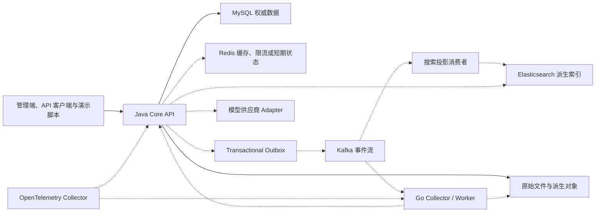

本文给出 VoiceInsight 的候选技术主线、Java 与 Go 的职责边界、组件引入顺序和重新评估条件。它是设计建议，不是当前代码事实；项目建仓时必须通过 ADR、依赖解析、最小样例和质量门禁确认精确版本。

项目目标与真实性边界见 [[VoiceInsight 项目实践总览]]，业务权威对象见 [[VoiceInsight 领域模型与数据契约]]。

## 架构结论

推荐采用“**Java 模块化单体 + Go 异步 Worker + 共享契约 + 分阶段基础设施**”：

- Java `core-api` 是系统入口和权威业务进程。
- Go `collector-worker` 只承担边界清晰的连接器、文件预处理、批量任务和后期 AI 分类工作负载。
- MySQL 是业务事实源；Elasticsearch、Redis 和模型输出都是派生或辅助数据。
- 第一版只需要 Java、MySQL 和本地对象存储抽象；Go、Kafka、Elasticsearch、Redis 与 AI 按路线逐步进入。
- 服务拆分以独立扩缩、失败隔离、不同运行时或数据生命周期为依据，不以“微服务更高级”为依据。

## 分阶段架构图



实线表示首个确定性版本必须存在，虚线表示后续阶段按真实需求引入。架构图不能被当作“所有组件已经部署”的证据。

## 候选代码仓库布局

建议先使用单一多语言仓库，减少个人项目在契约、演示数据和发布说明上的同步成本：

```text
voiceinsight/
├── services/
│   ├── core-api/                 # Java 权威业务与 Agent 入口
│   └── collector-worker/         # Go 连接器、批处理与异步任务
├── contracts/
│   ├── openapi/                  # 对外 HTTP 契约
│   └── events/                   # 事件 Schema 与兼容规则
├── fixtures/                     # 固定种子合成数据与预期结果
├── evals/                        # AI 评测集、评分程序与报告摘要
├── deploy/
│   └── compose/                  # 本地与演示环境编排
├── docs/
│   ├── adr/                      # 已确认的架构决策
│   └── runbooks/                 # 启动、发布、恢复和排障手册
└── Makefile                      # 统一发现入口，不隐藏底层命令
```

如果两个服务以后需要独立发布节奏或仓库权限，再通过 ADR 拆仓。拆仓前必须先证明契约生成、版本协调和端到端测试仍然可维护。

## Java 主线职责

Java `core-api` 负责：

- 认证、RBAC、产品或特性数据范围和审计主体。
- 产品、版本、特性、反馈、问卷、指标定义、报告和告警等权威模型。
- MySQL 事务、Flyway 迁移、MyBatis 查询和幂等写入。
- 上传与导入任务编排、最终业务校验和数据提交。
- 确定性分析 API、Top 问题、NPS / NSS 计算和证据查询。
- Transactional Outbox 与事件版本管理。
- 自然语言分析、RAG、工具编排和报告草稿的 AI Application Service。
- 对外 OpenAPI、错误模型、限流、健康检查和主要业务可观测性。

推荐从模块化单体开始。每个模块只通过应用服务或公开接口协作；Controller、模型 Adapter 和定时任务不得直接调用其他模块 Mapper。

## Go 主线职责

Go `collector-worker` 负责：

- 对明确授权来源实现连接器、分页、限速、退避、断点和增量游标。
- 下载、校验、解压、字符集识别、附件元数据提取和规范化输出。
- 消费异步任务，传播 `context.Context`，支持超时、取消、背压和优雅停机。
- 生成可复核的批处理 Manifest，由 Java 再执行业务校验和权威写入。
- 在 AI 阶段消费批量分类任务，通过固定 Schema 返回候选结果。
- 后期按需要提供只读 MCP 工具适配面，但不成为内部业务 Service 的替代品。

Go Worker 不直接修改 Java 所有的产品、权限、指标和人工分类权威表。需要跨边界写入时，通过版本化 HTTP 命令或事件结果进入 Java 应用服务。

## 共享而不复制的资产

| 共享资产 | Java 与 Go 必须一致 | 允许不同 |
| --- | --- | --- |
| OpenAPI | 资源语义、字段、错误类别、认证要求 | 客户端生成方式、Handler 组织 |
| 事件 Schema | 事件名称、版本、字段语义、幂等键 | 序列化库和消费循环 |
| 合成数据 | 稳定 ID、Schema、预期聚合结果 | 数据加载实现 |
| AI 评测集 | 输入事实、身份范围、期望类别、允许工具和禁止事实 | Prompt 拼装、SDK 和并发实现 |
| 可观测字段 | `traceId`、`requestId`、`jobId`、`eventId` 等关联语义 | 日志库、Agent 与 SDK |
| 安全边界 | 服务端身份、数据范围、超时、取消和秘密保护 | Spring Security 与 Go Middleware 的实现形态 |

Java 和 Go 共享产品语义，不逐行翻译异常、依赖注入、并发或包结构。

## 2026-08-27 候选技术基线

这些版本选择只用于启动评估；真正建仓时固定精确补丁版本、Wrapper 与镜像 Digest，并记录重新核对方法。

| 能力 | 推荐主线 | 选择理由与边界 |
| --- | --- | --- |
| Java 运行时 | Java 25 LTS | 当前 LTS，适合作为新个人项目基线；使用 OpenJDK 发行版并单独核对许可证与镜像来源 |
| Java 框架 | Spring Boot 4.1.x、Spring Security、Spring Modulith 候选 | Spring Boot 4.1 是当前稳定线；Modulith 只在模块测试和事件发布确有收益时引入 |
| Java 数据访问 | MyBatis + Flyway | 延续已有经验，同时强制学习 SQL、索引、事务和迁移；不同时维护 JPA 双实现 |
| Java AI | 官方 OpenAI Java SDK 优先，Spring AI 2.0.x 对照 | Responses API 能力先由官方 SDK 隔离；框架只在契约覆盖与观测收益明确后进入 |
| Go | 建仓时选择仍受支持且依赖验证通过的稳定版本 | Go 1.27 刚于 2026-08-19 发布；可先用成熟的 1.26 最新补丁，再在依赖和竞态测试通过后升级 |
| 关系数据库 | MySQL 8.4 LTS | 稳定 LTS 线，保存业务权威事实 |
| 缓存 | Redis | 只用于有观测证据的缓存、限流或短期状态，不作为 MySQL 的模糊替代品 |
| 事件流 | Apache Kafka | 在 Outbox、异步分类、搜索投影和报告事件形成后引入；首版不依赖它 |
| 搜索 | Elasticsearch | 同一派生引擎承担全文、结构化过滤、聚合和后期混合检索，避免再并列一个向量数据库 |
| 可观测性 | OpenTelemetry + Collector，后端按阶段选择 | 统一 Java、Go、消息与模型调用的 Trace 和指标；日志能力按各语言成熟度单独核对 |
| 本地交付 | Docker Compose | 先保证任意开发者能启动、初始化、验证和恢复；Kubernetes 不在主线 |
| CI/CD | GitHub Actions + 容器制品仓库 | 自动执行格式、测试、契约、扫描、镜像、Smoke Test 和发布证据 |

### 为什么不直接选 Java 21

Java 21 和 25 都是 LTS。对一个 2026 年新建的个人项目，Java 25 能减少很快再次升级的成本；但如果关键依赖、招聘目标或部署环境只验证到 Java 21，可以在项目阶段 0 选择 Java 21，并把原因写入 ADR。不能只因“越新越好”牺牲依赖兼容和可复现性。

### 为什么官方模型 SDK 先行

截至 2026-08-27，Spring AI 2.0 面向 Spring Boot 4.0 / 4.1，但其 OpenAI Chat 集成文档仍说明官方 OpenAI 的 Responses API 是另一个当前未由该客户端支持的端点。因此主线先用官方 SDK 建立 `ModelPort`，再用同一评测判断 Spring AI 在 Prompt、工具、MCP、观测或供应商切换上的实际收益。

这不是排斥框架，而是防止业务层被某个尚未覆盖目标 API 的抽象绑定。通用边界见 [[模型 SDK、业务适配层与 AI 框架边界]]、[[OpenAI Java Responses API 源码导读]] 和 [[Spring AI ChatClient 与 Advisor 源码导读]]。

## 同步与异步边界

### 同步 HTTP

用于：

- 创建导入任务与查询任务状态。
- 产品、特性、权限和指标的管理与查询。
- 需要立即给用户明确成功或失败的操作。
- Java 对 Go 管理端点的健康、能力或任务控制调用。

同步调用必须设置连接、响应和整体超时；重试只用于可证明幂等、可分类的瞬时失败。

### Kafka 事件

用于：

- 导入任务已准备、反馈已接收、分类请求和结果。
- 搜索投影增量更新与重建请求。
- 报告生成、告警通知和审计派生处理。

数据库提交和事件发布通过 Transactional Outbox 降低双写风险。Kafka 的成功写入不表示 Elasticsearch、模型或报告已经处理完成；每个消费者维护自己的状态和可观测积压。

### 对象引用

大文件、原始压缩包、规范化 JSONL 和报告制品保存在对象存储抽象中。消息只携带对象 ID、内容散列、大小、媒体类型和 Schema 版本。消费者下载前重新校验授权、大小与散列。

## 存储职责

### MySQL

- 保存权威业务数据、状态机、Outbox、幂等结果和审计索引。
- 先通过正确索引、稳定分页和批处理解决问题，再讨论分区或分库分表。
- 报表查询与在线事务需要隔离时，先通过查询模型、只读副本或离线聚合评估，不立刻拆数据库。

### Redis

候选用例按优先级是短期限流、热点元数据缓存和幂等窗口。每个 Key 都要定义：权威来源、TTL、容量、失效和 Redis 不可用时的行为。没有压测证据时，不为“用上 Redis”缓存所有查询。

### Elasticsearch

- 保存反馈的派生全文、过滤字段、Embedding 和索引版本。
- 权限范围同时进入候选查询和结果后置校验。
- 索引可以从 MySQL 和对象存储重建，不能反向成为恢复权威源。
- 第一版搜索只用 MySQL；当全文、相关性或混合检索需求通过用例和数据量证明后才接入。

## 部署演进

1. **本地确定性版本**：Java + MySQL，文件存储通过 Port 使用本地实现。
2. **多进程版本**：加入 Go Worker 和对象存储实现，先用显式任务协议验证边界。
3. **异步搜索版本**：加入 Outbox、Kafka 与 Elasticsearch，验证重复、积压和重建。
4. **可观测演示版本**：加入 OpenTelemetry Collector、指标与 Trace 后端。
5. **公开演示环境**：通过 Compose 或单机容器发布，验证备份、恢复、健康检查和回滚。

Kubernetes 只有在需要展示平台工程、多个节点调度或与目标岗位强相关时才作为独立后续路线；它不能替代应用的健康、幂等、恢复和容量证据。

## 被否决或暂缓的方案

| 方案 | 当前结论 | 原因 | 重新评估条件 |
| --- | --- | --- | --- |
| Java 与 Go 各写一套完整后台 | 否决 | 双倍维护成本，业务成果被重复 CRUD 稀释 | 明确需要语言级等价研究且已有自动契约评测 |
| 启动即全微服务 | 否决 | 边界尚未由业务和流量证明，增加分布式事务与部署成本 | 模块确有独立扩缩、故障隔离或团队所有权需求 |
| 启动即 Kafka | 暂缓 | 确定性 MVP 可以同步完成，先学习 Outbox 与任务状态 | 出现多个独立消费者、重放或积压治理需求 |
| MySQL、Elasticsearch、Qdrant 同时保存检索数据 | 否决 | 个人项目运维面过大且事实来源易漂移 | Elasticsearch 无法满足经评测确认的向量需求 |
| Agent 直接 Text-to-SQL | 否决 | Schema 泄漏、越权、资源失控和结果不可验证 | 不作为当前项目重评项；使用受限分析工具替代 |
| 多 Agent | 暂缓 | 单 Agent 与确定性工作流尚未证明不足 | 固定评测显示单 Agent 在明确任务分工上持续失败 |
| Kubernetes | 暂缓 | 对当前产品主线的边际价值低于测试、观测和恢复 | 稳定 Compose 版本完成，且目标岗位需要平台能力 |

## 建仓前必须确认的 ADR

1. Java 25 / Spring Boot 4.1 与关键依赖兼容基线。
2. Go 初始版本和升级策略。
3. 单仓与未来拆仓条件。
4. 本地对象存储实现和公开演示环境的持久化方案。
5. OpenAPI、事件 Schema 和共享 fixture 的所有权。
6. Java 官方模型 SDK与 Spring AI 的使用边界。
7. Elasticsearch 进入条件和索引重建策略。
8. Kafka 进入条件、Outbox 投递方式和消息兼容策略。

用户确认前，这些都是候选；确认后 ADR 才记录“采用了什么以及为什么”。

## 官方资料快照

以下资料于 2026-08-27 核对，只支撑候选版本与能力判断，不能代替建仓时的依赖测试：

- [Oracle Java SE Support Roadmap](https://www.oracle.com/java/technologies/java-se-support-roadmap.html)：Java 21 与 25 的 LTS 状态。
- [Spring Boot System Requirements](https://docs.spring.io/spring-boot/system-requirements.html)：当前稳定线与 Java 兼容范围。
- [Spring AI 2.0 GA](https://spring.io/blog/2026/06/12/spring-ai-2-0-0-GA-available-now/)：Spring Boot 4.0 / 4.1 基线。
- [Spring AI OpenAI Chat](https://docs.spring.io/spring-ai/reference/api/chat/openai-chat.html)：当前客户端能力与 Responses API 边界。
- [Go Release History and Policy](https://go.dev/doc/devel/release)：当前版本与支持规则。
- [MySQL Innovation and LTS](https://dev.mysql.com/doc/refman/8.4/en/mysql-releases.html)：MySQL 8.4 LTS 轨道。
- [Apache Kafka Documentation](https://kafka.apache.org/documentation/)：当前版本入口以及事件、生产者、消费者和 Streams 的职责。
- [Elasticsearch Vector Search](https://www.elastic.co/docs/solutions/search/vector)：全文、过滤、聚合与向量检索组合能力。
- [OpenTelemetry Language APIs and SDKs](https://opentelemetry.io/docs/languages/)：Java 与 Go 的信号成熟度。
