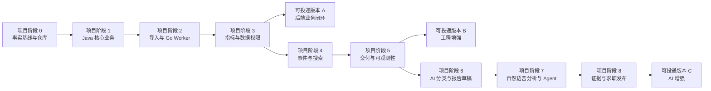

本文把 VoiceInsight 从候选设计推进为可验证项目，定义每个项目阶段的进入条件、任务、产物、退出标准和明确不提前做的内容。

为避免与 [[AI 应用开发学习路线图]] 的“AI 阶段”混淆，本文统一使用“项目阶段 0～8”。阶段完成由代码和证据判定，不按固定周数，也不要求全部完成后才开始投递简历。

## 推进原则

1. 一个阶段最多引入一到两个新的主要基础设施概念。
2. 先完成同步、确定性和可测试的版本，再异步化或拆进程。
3. 新组件必须有进入理由、故障行为、删除或回退方案和验收用例。
4. 每个阶段先建立失败测试，再把一次成功演示升级为可重复证据。
5. 未开始阶段不预建空包、空接口、空目录和空执行记录。
6. 文档、代码、迁移、契约、测试、镜像和演示数据在同一 revision 下交付。
7. 求职版本按完成证据发布，不等待理想化“终局架构”。

## 路线总览

## 项目阶段总表

| 项目阶段 | 核心问题 | 主要产物 | 退出证据 |
| --- | --- | --- | --- |
| 0. 事实基线与仓库 | 我们到底要做什么，如何证明 | ADR、合成数据、契约骨架、质量入口 | 干净克隆能执行基础门禁，产品和版本决策可定位 |
| 1. Java 核心业务 | 没有 AI 时平台是否有价值 | 权限、产品特性、反馈问卷、迁移与 API | 端到端业务、越权和迁移测试通过 |
| 2. 导入与 Go Worker | 大文件、部分失败、取消如何可靠处理 | 上传任务、Manifest、Go 预处理 Worker | 重复、损坏、取消和恢复用例可重放 |
| 3. 指标与数据权限 | 指标是否正确、可追溯且不越权 | NPS / NSS、Top 问题、审计、查询优化 | 固定预期结果、Explain 证据和跨层权限拒绝 |
| 4. 事件与搜索 | 如何解耦异步工作和全文检索 | Outbox、Kafka、Elasticsearch、重建 | 重复消费、积压、索引漂移和重建演练 |
| 5. 交付与可观测性 | 系统如何发布、定位和恢复 | Compose、CI/CD、OpenTelemetry、备份恢复 | 一次发布、回滚、故障定位和恢复记录 |
| 6. AI 分类与报告草稿 | 模型如何提供受控增量价值 | 结构化分类、人工复核、报告草稿、评测 | 固定数据上的质量、安全、成本和降级结果 |
| 7. 自然语言分析与 Agent | 自然语言如何安全访问业务工具 | 只读工具、RAG、Agent 状态机、MCP 候选 | 工具、参数、权限、引用、取消和攻击评测 |
| 8. 证据与求职发布 | 如何让他人复现并相信 | Demo、架构说明、指标报告、简历口径 | fresh clone 重放、证据索引和公开仓库审计 |

## 项目阶段 0：事实基线与仓库

### 进入条件

- 用户确认工作名或接受 `VoiceInsight` 作为暂定名。
- 用户确认首个可投递版本只做合成数据和个人项目，不导入公司资产。
- 用户确认 [[VoiceInsight 总体架构与语言分工]] 中 Java / Go 主责方向。

### 实施内容

1. 创建单一代码仓库，记录初始 revision 和许可证选择。
2. 固定 Java、Spring Boot、Go、MySQL 和构建工具的精确版本；用最小样例验证依赖兼容。
3. 建立 `services/`、`contracts/`、`fixtures/`、`evals/`、`deploy/` 和 `docs/` 的首批实质文件，不创建空未来模块。
4. 编写产品边界 ADR、语言分工 ADR、数据保密规则和贡献说明。
5. 建立固定种子的 `smoke` 合成数据，包含已知指标答案和权限样例。
6. 创建 Java、Go 的最小健康服务与统一质量入口，但不预埋 AI 包和未来业务 Controller。
7. CI 先运行格式、单元测试、依赖解析、秘密扫描和构建。

### 退出标准

- fresh clone 后可按 README 启动最小依赖并运行全部当前门禁。
- `git status` 在生成与测试后仍符合预期，生成物归属明确。
- 合成数据不含真实品牌、人员、内部域名、日志或凭据。
- 每个已采用版本、框架和仓库结构都有 ADR 或项目声明来源。
- 未实现能力在 README 中明确列为路线，而不是功能清单。

### 不提前做

Kafka、Elasticsearch、Redis 缓存、模型调用、MCP、Kubernetes 和公网部署。

## 项目阶段 1：Java 核心业务闭环

### 进入条件

项目阶段 0 通过；权威领域对象和数据范围获得确认。

### 实施内容

1. 使用 Flyway 建立账号、角色、产品范围、产品、版本、特性、来源、反馈、问卷和审计基础迁移。
2. 使用 Spring Security 建立认证、操作权限与产品数据范围，身份只来自服务端上下文。
3. 通过 MyBatis 实现稳定分页、条件查询和批量写入；为主要查询编写索引说明。
4. 用 OpenAPI 定义产品、特性、反馈和问卷的管理与查询契约，统一 Problem Details 或等价错误模型。
5. 实现 JSON / 小型 CSV 的同步导入最小链路，用于先验证业务语义。
6. 建立 Controller、Application Service、领域规则与 Mapper 边界。
7. 使用 Testcontainers 验证真实 MySQL 迁移、事务、索引和权限查询。

### 必测失败

- 无权用户读取或写入其他产品。
- 同一特性树形成环或引用已废弃父节点。
- 问卷评分越界、缺失口径或使用不存在的产品版本。
- 分页期间存在相同排序值，结果仍保持稳定。
- 事务中途失败后没有部分权威数据残留。

### 退出标准

- 第一条演示故事的“用户、产品、反馈、问卷、越权拒绝”可以端到端重放。
- 全部数据库变更由迁移产生，空库和历史升级路径都通过测试。
- OpenAPI 与实际路由、响应和安全要求有自动一致性检查。
- 没有 AI、消息队列和全文搜索时，项目仍是一个可解释的后端系统。

## 项目阶段 2：可靠导入与 Go Worker

### 进入条件

项目阶段 1 的业务写入和权限边界稳定；同步导入的瓶颈和失败语义已经被测试暴露。

### 实施内容

1. 在 Java 建立上传会话、导入任务、幂等键、状态机、行级错误和取消 API。
2. 对压缩包、表格和附件设置类型、大小、条目数、解压总量、嵌套层级和超时上限。
3. Go Worker 读取任务，完成字符集、CSV / Excel 结构、内容散列、附件元数据和规范化 JSONL Manifest。
4. Go 使用 `context.Context` 传播取消与超时，设置有界并发、速率限制、背压和优雅停机。
5. Java 读取 Manifest 后做最终业务校验和批次提交；Go 不直写权威业务表。
6. 为每个任务保存重试次数、错误类别、最后安全检查点和对象散列。
7. 执行 `go test -race`、基准测试和 Goroutine 泄漏检查。

### 必测失败

- 文件内容与声明散列不一致。
- ZIP 路径穿越、压缩炸弹、超大工作表和表格公式注入。
- 同一幂等键配不同文件、同一文件重复提交和网络超时后重查。
- Worker 在验证、批量提交前后分别收到取消。
- Go 进程重启后任务不会永久卡在运行态，也不会重复写入。

### 退出标准

- 损坏、部分失败、重复、取消和恢复均有端到端自动化用例。
- Java 与 Go 对 Manifest、错误类别和任务状态拥有契约测试。
- 导入吞吐和内存使用在记录硬件与数据集下完成基线，不编造生产能力。
- 可以从任务 ID 追踪到原始对象、Manifest、业务记录和错误行。

## 项目阶段 3：指标分析与数据范围

### 进入条件

反馈与问卷数据稳定进入 MySQL；评分方案、特性树和发生时间语义已经版本化。

### 实施内容

1. 实现版本化 NPS / NSS 定义、分子分母和有效样本统计。
2. 实现按时间、产品、版本、特性和来源的趋势与 Top 问题查询。
3. 为所有聚合返回实际过滤条件、时区、口径版本、数据截止点和样本量。
4. 设计稳定分页、覆盖索引或查询重写，并保存 `EXPLAIN ANALYZE` 或适用证据。
5. 建立导出权限、字段脱敏、审计和速率上限。
6. 只有热点查询和回源行为可测时，才引入第一个 Redis 用例；Redis 失败必须能回源或明确拒绝。
7. 用生成器预计算的期望结果做属性测试和差分测试，防止 SQL 改写改变口径。

### 必测失败

- 评分方案在时间边界发生变化。
- 有效样本为零、样本量过小、数据跨时区和重复问卷。
- 无权产品被放入过滤条件、缓存 Key 或导出任务。
- Top 问题计数与证据明细数量不一致。
- 缓存比权威数据旧，响应能说明新鲜度且不会越权复用。

### 退出标准：可投递版本 A

- 完成不依赖 AI 的完整业务演示、权限拒绝与指标复核。
- 固定数据的 NPS / NSS 和 Top 问题结果由自动化测试证明。
- 主要查询拥有索引理由、计划与实际基线。
- 简历可以只写已实现的 Java / MySQL / 权限 / 导入 / 指标事实；不得预写后续组件。

## 项目阶段 4：异步事件与搜索投影

### 进入条件

至少存在两个独立异步消费者或明确重放需求；MySQL 查询已经无法满足全文、相关性或混合检索用例。

### 实施内容

1. 在 Java 事务中写入 Outbox，建立投递器、重试、租约和积压指标。
2. 引入 Kafka，定义反馈接收、分类请求、搜索同步和报告请求的版本化事件。
3. 消费者实现幂等、手动位点边界、重试上限、死信或隔离队列和重放工具。
4. 建立 Elasticsearch 索引模板、别名、文档版本和全量重建流程。
5. 搜索先实现关键词 + 结构化过滤，再建立 Embedding 与混合检索实验。
6. 权限范围同时进入 Elasticsearch 候选查询和后端结果复核。
7. 记录 Kafka Key 与分区顺序依据，不能把全局顺序当作默认保证。

### 必测失败

- 数据库提交成功但发布暂时失败。
- 消费完成但位点未提交，消息重复到达。
- 旧版本事件晚到、新版本文档已存在和删除事件乱序。
- Elasticsearch 不可用、索引部分损坏或别名切换失败。
- 搜索文档仍含已归档或已撤权数据。

### 退出标准

- 关闭任一消费者后能观察积压，恢复后可安全追平。
- 从 MySQL 全量重建新索引、校验数量与抽样内容、切换并回退的演练通过。
- 重复、乱序、死信和重放用例不会破坏权威数据。
- 搜索效果由固定查询集比较，不以“能搜到一条”作为完成标准。

## 项目阶段 5：交付、可观测性与故障恢复

### 进入条件

Java、Go、MySQL、Kafka 和 Elasticsearch 的本地链路稳定；每个组件有明确健康和数据职责。

### 实施内容

1. 用 Docker Compose 编排应用与依赖，区分配置、秘密、持久卷和初始化任务。
2. 构建多阶段镜像、非 Root 运行、健康检查、资源限制和优雅终止。
3. CI 执行格式、Lint、单元、集成、契约、竞态、依赖和镜像扫描，再构建制品。
4. 使用 OpenTelemetry 传播 HTTP、Kafka、任务和模型调用上下文。
5. 建立请求、导入、消费、搜索、报告和模型调用的指标与告警候选。
6. 编写发布、回滚、备份、恢复、索引重建、队列积压和磁盘满 Runbook。
7. 执行一次真实备份恢复和一次故障演练，记录环境、revision、时间和结果。

### 必测失败

- Java 或 Go 在处理中收到终止信号。
- Kafka、Elasticsearch、Redis 或模型依赖超时。
- MySQL 连接池耗尽、磁盘空间不足和对象存储暂时不可用。
- 新版本健康检查失败，部署回滚到前一制品。
- Trace 上下文缺失时仍能通过任务或事件 ID 定位链路。

### 退出标准：可投递版本 B

- 干净环境可以启动、初始化、Smoke Test、停止和再次启动，持久数据符合预期。
- 一次发布、回滚、备份恢复和索引重建都有日期化执行记录。
- Java 到 Go、Kafka、搜索的关键链路可以用 Trace 与结构化日志解释。
- 性能数据记录硬件、数据集、命令、分位数、错误率和瓶颈，不只写平均值。

## 项目阶段 6：AI 分类与报告草稿

### 进入条件

- 项目阶段 5 的数据、权限、异步和观测底座通过。
- AI 阶段 1～2 的独立模型 API、结构化输出、错误与评测实验已完成。
- 存在人工标注的合成评测集和分类方案版本。

### 实施内容

1. Java 创建分类任务，Go Worker 或独立 Java Adapter 返回固定 Schema 的问题与特性候选。
2. 候选保存 Prompt、模型、Schema、分类树和反馈修订版本。
3. 建立人工复核、拒绝、修正和模型结果对比，不覆盖原始文本与既有人工标签。
4. 报告先由确定性查询生成数值与证据包，再让模型生成有引用的文字草稿。
5. 建立超时、取消、429、5xx、结构错误、内容过滤和成本预算。
6. 评测包含典型、边缘、未知类别、越权和提示注入样例。

### 退出标准

- Schema、业务校验和数据范围硬约束没有绕过样例。
- 分类质量按类别报告，包含弃权覆盖率和人工复核结果。
- 报告中的数值与引用可由确定性数据包逐项复核。
- 模型不可用时，导入、查询和指标仍可用；AI 任务有明确失败或排队状态。

## 项目阶段 7：自然语言分析、RAG 与只读 Agent

### 进入条件

- 确定性分析 Service、搜索证据、权限和 AI 评测分别稳定。
- 所有候选工具已经作为普通 API 通过授权、超时和集成测试。
- [[VoiceInsight AI 应用与受控 Agent 设计]] 的工具和停止边界获得确认。

### 实施内容

1. 把自然语言请求映射为允许枚举、日期范围、产品范围和结果上限。
2. 数值问题调用确定性分析工具；资料解释使用带来源 RAG；两者不能互相替代。
3. Agent 只拥有审核过的只读工具，设置步骤、时间、Token、成本和工具调用上限。
4. 工具从服务端上下文注入身份与数据范围，不接收模型指定的可信主体。
5. 实现取消、部分失败、证据不足拒答、模型与搜索降级。
6. Go MCP 只读适配面作为后期互操作实验，默认不暴露写操作和内部数据库。
7. 使用 Trace、工具选择评分、参数准确率、引用准确率和攻击集持续评测。

### 退出标准

- Top 问题、趋势和反馈证据问题在固定数据上可重复得到正确范围与数值。
- 越权、提示注入、恶意检索内容和工具参数污染不会扩大数据范围。
- Agent 循环、超时、取消和依赖失败都进入确定终态。
- 任何写操作仍在 Agent 能力外；“生成报告草稿”与“发布报告”保持分离。

## 项目阶段 8：证据收口与求职发布

### 进入条件

选择准备发布的 A、B 或 C 版本；不要求未选择的后续能力完成。

### 实施内容

1. 从 fresh clone 按公开 README 重放启动、数据初始化、测试和演示。
2. 建立架构图、领域图、API 文档、评测报告、性能报告、Trace 与恢复记录索引。
3. 对仓库做秘密、真实公司信息、个人路径、动态地址、许可证和大文件审计。
4. 将简历句式中的占位值替换为当前 revision 可重现的实际数字。
5. 录制短演示或准备固定演示脚本，覆盖成功、权限拒绝和降级。
6. 标明已知限制、没有运行的检查和后续路线。

### 退出标准：可投递版本 C 或所选版本

- 新环境可以重放主要链路，步骤不依赖作者机器上的隐藏状态。
- 简历、README、代码、测试、演示和报告指向同一可定位 release 或 commit。
- 所有“实现、通过、提升、支持”声明都有证据；计划内容使用未来时。
- 工作经历和个人项目的边界符合 [[VoiceInsight 求职展示与简历口径]]。

## 阶段执行记录规则

真正开始某个项目阶段时，才在对应代码仓库或本项目实践下建立日期化执行记录。记录至少包含：

- 代码 revision、未提交差异和环境。
- 精确版本、配置来源和数据集版本。
- 实际命令、退出码、PASS / FAIL / SKIP。
- 成功链路、失败链路、指标和 Trace 标识。
- 残留风险、恢复点和下一次重放方法。

路线图只维护预期与门槛，不通过修改“当前状态”来覆盖历史证据。
