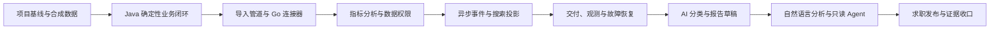

VoiceInsight 是一个从真实“用户声音收集、分析与决策支持”业务中抽象出来的个人项目候选，中文定位为“多源用户反馈智能分析平台”。它面向产品负责人、质量人员和数据分析人员，统一接收反馈、Beta 问题与问卷数据，提供可追溯的数据治理、指标分析、报告告警，以及受控的 AI 分类和自然语言分析能力。

本文负责给出项目判断、目标、边界、路线关系和笔记导航。业务细节、数据契约、技术选择、实施阶段、AI 边界、质量门禁与求职口径分别由后续专题笔记负责。

> [!important] 当前状态
> 本目录是 2026-08-27 形成的 Codex 初稿和候选设计。当前没有 VoiceInsight 代码仓库、提交、构建、测试、部署或评测证据，文中的“应”“计划”“候选”均不代表已经实现。产品边界与关键技术选择需要在真正建仓前由用户最终确认。

## 结论：方向合理，但必须换一种落地方式

这个想法合理，并且比凭空编造一个电商或秒杀项目更有辨识度。它的优势不是“功能多”，而是能回答三个真实问题：数据从哪里来、为什么难以可信分析、AI 应该在哪些边界内工作。

要让它真正增强求职竞争力，需要做五项调整：

1. **把工作经历与个人项目分开。** 工作经历只写在职期间真实完成的优化和需求；VoiceInsight 写成“受真实业务启发、使用合成数据独立重构的个人项目”，不能暗示它已在原公司上线。
2. **只保留一条连续产品主线。** 从数据进入平台，到可追溯分析，再到报告和只读 Agent；每项技术必须服务于这条主线，而不是为了简历关键词存在。
3. **Java 与 Go 按职责合作。** Java 负责权威业务、权限、事务、分析与 Agent 编排；Go 负责连接器、批处理和异步工作负载。两套语言共享契约与评测，不重复造两套完整后台。
4. **先模块化单体，再按证据拆分。** 第一版不以微服务、Kafka、Elasticsearch 或 Kubernetes 起步。先跑通确定性业务闭环，确认异步吞吐、搜索和部署问题真实存在后再引入对应组件。
5. **AI 后置于可信数据和确定性工具。** 分类、报告草稿和自然语言分析必须依赖稳定数据契约；Agent 只调用受控工具，不能直接写 SQL、绕过权限或把模型文本当成指标事实。

## 为什么这个项目适合当前能力结构

原始能力自评显示，Java、Spring、MySQL、Linux 和一般工程开发已有实践基础，而消息队列、搜索、分布式系统、可观测性和架构设计仍缺少系统经验。项目路线据此采用“已知能力先形成产品闭环，陌生能力逐层加入”的顺序：

| 当前基础 | 在 VoiceInsight 中的起点 | 后续提升方式 |
| --- | --- | --- |
| Java、Spring、MyBatis、MySQL 已有实践 | 先实现权威业务与数据模型 | 补齐事务、索引、测试、安全和问题诊断 |
| Go 有 Web 框架实践，底层并发与诊断较弱 | 从无状态连接器和批处理开始 | 通过取消、限流、背压、竞态检测和 Profiling 提升 |
| API、Redis、Docker、工程质量约为了解阶段 | 在明确用例中逐项使用 | 每项都设置失败场景与验收证据，不只“接入依赖” |
| 消息队列、搜索、分布式、可观测性尚未系统实践 | 不作为启动前置条件 | 在数据量、异步或跨进程链路出现后再引入 |
| Agent 应用是新增方向 | 先完成独立模型调用与评测 | 数据、权限和工具稳定后才接入正式项目 |

这能避免一个常见失败：同时学习太多陌生组件，最后只得到一个能启动、不能解释也不能验证的 Docker Compose。

## 一句话产品定义

> VoiceInsight 把多来源、格式不一的用户反馈和问卷数据转化为可追溯的产品问题、趋势指标与证据集合，并通过受控 AI 帮助内部人员分类、检索、解释和生成报告草稿。

关键词是“可追溯”和“受控”：

- 每个结论能够回到来源记录、导入批次、计算口径和数据范围。
- 权限、数值、状态、事务和副作用由确定性后端负责。
- 模型可以理解和生成，但不能成为业务事实源。

## 项目目标

### 产品目标

- 统一导入文本反馈、Beta 问题、问卷和附件元数据。
- 建立产品、特性、来源、观点或问题、问卷和指标的稳定模型。
- 提供按产品、特性、来源、时间和问题类别查询与聚合的接口。
- 版本化管理 NPS、NSS 等评分口径，避免计算规则散落在 SQL 中。
- 通过数据范围权限限制不同负责人只能访问被授权产品或板块。
- 支持分类审核、定时报告、异常趋势告警与可追溯审计。
- 在可信工具之上提供自然语言分析和带证据回答。

### 工程目标

- 形成 Java 与 Go 职责清晰、契约可验证的多语言工程。
- 覆盖数据库迁移、OpenAPI、幂等导入、异步任务、搜索派生索引、缓存、可观测性、CI/CD、备份恢复和安全门禁。
- 每一阶段都有固定数据、自动化测试、失败演示和可重放证据。
- 最终能够用一条可重复演示链路解释业务价值与工程取舍。

### 求职目标

- 用真实问题抽象和可验证实现替代“玩具 CRUD”叙事。
- 同时展示 Java 深度、Go 工程能力和 AI 应用边界。
- 让简历上的每个数字、性能结论和 AI 效果都有仓库内证据。

## 明确不做

- 不复制原公司的代码、表结构、日志、截图、数据、内部名称或部署信息。
- 不把“受真实业务启发”写成“已在原公司落地的新系统”。
- 不在首版实现多租户 SaaS、计费、复杂工作流平台或移动端。
- 不为了展示名词同时引入多个消息队列、搜索引擎、向量数据库或 AI 框架。
- 不抓取未经授权的网站；连接器先使用合成数据、公开许可数据或明确授权的 API。
- 不让模型直接生成并执行 SQL，不让 Agent 自动修改分类、权限、告警规则或报告发布状态。
- 不把 Kubernetes 和多 Agent 作为主线；只有稳定部署与评测证明需要时才重新评估。

## 连续实践主线

路线不是要求做完全部内容后才开始求职：

- 完成确定性业务、数据权限和指标分析后，可以形成后端可投递版本。
- 完成异步、搜索、可观测性和恢复演练后，可以形成工程增强版本。
- 完成固定评测、只读工具和 Agent 安全边界后，再形成 AI 增强版本。

具体进入条件、退出标准和阶段产物见 [[VoiceInsight 迭代实施路线图]]。

## Java 与 Go 的项目关系

VoiceInsight 不采用“Java 和 Go 分别实现全部功能”的双倍工作量方案：

| 责任 | Java 主线 | Go 主线 |
| --- | --- | --- |
| 权威业务数据 | 产品、特性、反馈、问卷、权限、报告和审计 | 不直接修改权威业务表 |
| 同步 API | 认证、CRUD、查询、指标与 Agent 入口 | 健康检查、任务控制或内部管理入口 |
| 数据进入 | 创建导入任务、校验业务语义、提交最终数据 | 连接外部来源、下载、解压、规范化和批处理 |
| AI | 自然语言分析、RAG、工具编排和报告草稿 | 批量分类实验、受控任务执行和后期只读 MCP 适配面 |
| 共同资产 | OpenAPI、事件 Schema、合成数据、评测集、错误分类和 Trace 关联字段 | 同左 |

完整候选架构与拆分依据见 [[VoiceInsight 总体架构与语言分工]]。

## 事实来源与保密边界

- 业务问题来自个人经历总结在 2026-08-27 提供的描述，只抽取“多源反馈、问卷指标、分类、报告、权限”等通用需求。
- 项目不以原平台的实现作为代码或数据基线；没有得到的细节一律不补写成事实。
- 演示数据使用虚构产品、虚构用户、合成文本和生成附件。
- 将来建立代码仓库后，当前代码、迁移、契约、测试和 CI 才是项目行为的权威来源；本目录只记录项目决策、顺序与验收。

## 项目实践导航

| 笔记 | 负责问题 |
| --- | --- |
| [[VoiceInsight 产品边界与演示场景]] | 谁使用、解决什么问题、MVP 到哪里、如何演示 |
| [[VoiceInsight 领域模型与数据契约]] | 权威对象、状态、来源追踪、幂等和跨进程契约 |
| [[VoiceInsight 总体架构与语言分工]] | Java / Go 职责、组件引入顺序与候选技术基线 |
| [[VoiceInsight 迭代实施路线图]] | 从建仓到可投递版本的进入条件、产物和退出标准 |
| [[VoiceInsight AI 应用与受控 Agent 设计]] | 分类、RAG、自然语言分析、工具、评测和安全红线 |
| [[VoiceInsight 工程质量、验证与交付标准]] | 测试、性能、观测、安全、部署、恢复和证据门禁 |
| [[VoiceInsight 求职展示与简历口径]] | 工作经历与个人项目分界、演示材料和可写简历句式 |

通用 AI 学习继续使用 [[AI 应用开发学习路线图]]；通用知识不在本项目目录重复维护。

## 当前下一步

1. 用户确认或调整项目工作名、首个可投递版本边界，以及 Java / Go 的候选职责分工。
2. 确认后再建立代码仓库，记录真实 Git revision、构建工具与依赖版本。
3. 先完成 [[VoiceInsight 迭代实施路线图]] 的项目阶段 0，不预建后续阶段的空包、空服务或空执行记录。
4. 项目阶段 0 退出前，不在简历中写 VoiceInsight 已实现；可以把它作为正在建设的个人项目准备材料。
