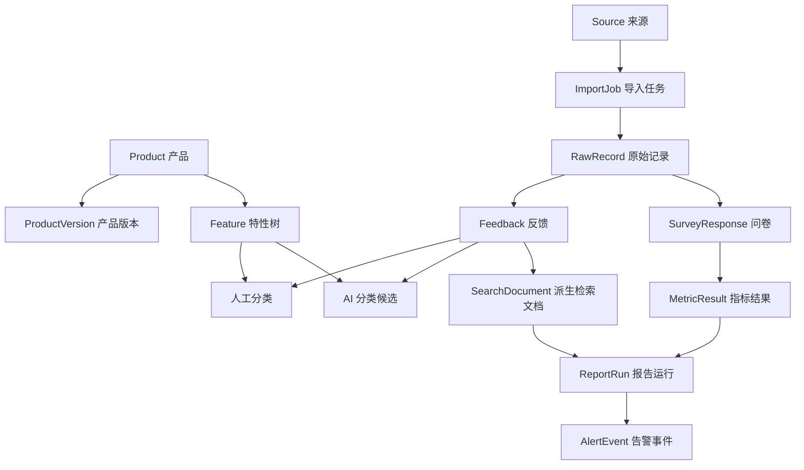
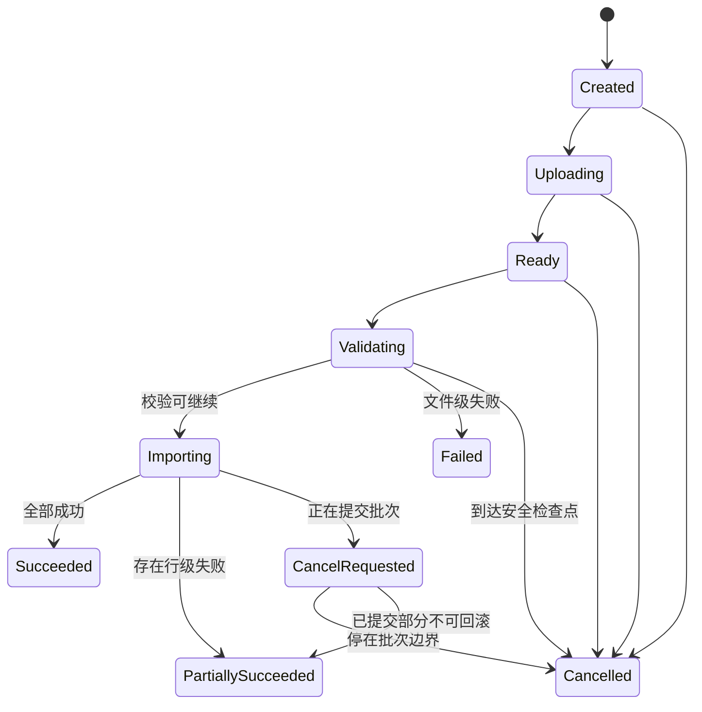
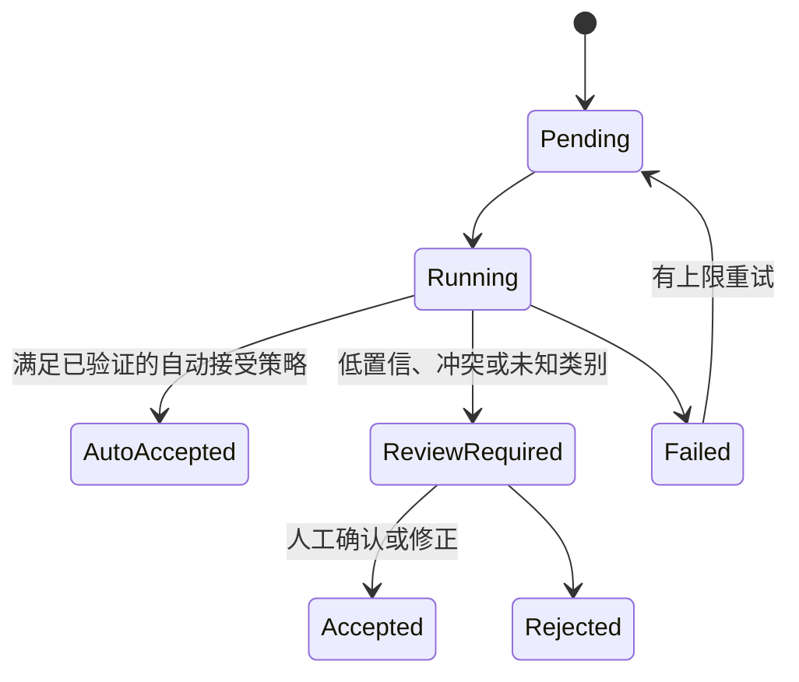

本文定义 VoiceInsight 的候选模块边界、权威数据、派生数据、状态机、幂等规则和跨进程契约。它用于约束后续实现，不是已经存在的数据库设计；真正建仓后，迁移、OpenAPI、事件 Schema 与测试才是精确事实来源。

产品语义见 [[VoiceInsight 产品边界与演示场景]]，进程与存储组合见 [[VoiceInsight 总体架构与语言分工]]。

## 设计原则

1. 原始数据、规范化结果、人工判断和 AI 候选结果分开保存，不能互相覆盖。
2. MySQL 保存业务权威事实；缓存、全文索引、向量和报表快照都是可重建派生数据。
3. 每次导入、分类、指标计算、报告和告警都必须携带口径版本与来源标识。
4. 客户端和模型提供的身份、角色、产品范围与“已确认”标志都不可信。
5. 跨进程传递标识、版本和对象引用，不在消息中复制大附件或无限增长的业务对象。
6. “至少一次”交付下，消费者必须通过业务幂等保证重复消息不产生重复结果。
7. 数据量和查询模式没有证据前，不提前分库分表或构造微服务数据库。

## 候选业务模块

| 模块 | 负责内容 | 不负责内容 |
| --- | --- | --- |
| Identity & Access | 账号、角色、权限、产品数据范围、会话和审计主体 | 由模型判断用户身份或授权 |
| Product Catalog | 产品、版本、地区、特性树与分类口径 | 反馈文本和指标事实 |
| Ingestion | 上传会话、导入任务、来源记录、校验、规范化和幂等接收 | AI 分类的最终人工结论 |
| Feedback | 市场反馈、Beta 问题、附件引用、人工标签和生命周期 | 问卷评分聚合 |
| Survey Analytics | 问卷、评分答案、指标定义与确定性聚合 | 模型生成数值或改变公式 |
| Search Projection | 全文、结构化过滤、向量字段和重建游标 | 成为反馈权威数据库 |
| Report & Alert | 报告定义、运行、草稿、发布、告警规则与事件 | 无样本量或无基线的模型告警 |
| AI Assistance | 分类候选、Prompt 版本、模型调用、工具运行和评测关联 | 权限、事务、指标公式和最终发布决定 |
| Audit | 关键写操作、导出、权限拒绝和 Agent 工具调用记录 | 保存秘密或完整敏感正文 |

第一版可以把这些模块放在一个 Java 进程和一个数据库中，但代码依赖必须朝向模块公开接口，不允许 Controller 或 AI Adapter 直接跨模块访问 Mapper。

## 领域关系

图中的箭头表示业务关联，不等同于每条关系都用数据库外键实现。是否使用外键要根据删除语义、迁移和批量写入验证后决定。

## 核心对象候选

| 对象 | 稳定身份与关键版本 | 主要不变量 |
| --- | --- | --- |
| `Product` | `productId`、状态版本 | 归档产品不可接收新业务数据，但历史结果仍可查询 |
| `ProductVersion` | `productVersionId`、业务版本名 | 同一产品内版本标识唯一，时间范围不能自相矛盾 |
| `Feature` | `featureId`、`taxonomyVersion`、父节点 | 不允许环；废弃节点保留历史映射，不物理复用标识 |
| `Source` | `sourceId`、来源类型、Schema 版本 | 每个来源声明允许字段、授权方式与删除要求 |
| `ImportJob` | `importJobId`、状态版本、提交幂等键 | 状态只能按允许路径前进；终态不会被重试改回运行态 |
| `RawRecord` | 来源标识、源记录标识、内容散列 | 原始快照不可被规范化或分类结果覆盖 |
| `Feedback` | `feedbackId`、业务修订号 | 必须关联产品、来源、发生时间和可追溯原始记录 |
| `SurveyResponse` | `surveyResponseId`、评分方案版本 | 评分必须落在方案范围内；无效答案不进入分母 |
| `ClassificationCandidate` | 反馈修订、分类方案、Prompt 与模型快照 | 只表示候选；不能自动替换已确认人工结果 |
| `MetricDefinition` | 名称、版本、生效时间 | 公式、阈值、分母和空值规则不可静默修改 |
| `ReportRun` | 定义版本、数据截止点、运行尝试 | 已发布报告不可被后台重跑静默覆盖 |
| `AlertEvent` | 规则版本、观测窗口、去重键 | 同一规则和窗口不重复通知；必须保存触发证据 |
| `AuditEvent` | 事件 ID、主体、动作、对象和时间 | 只追加；内容最小化且能关联请求或 Trace |

标识类型在项目阶段 0 通过 ADR 确认。无论选 UUID、UUIDv7、ULID 或数据库生成值，对外契约都不能依赖连续性推断权限或数量。

## 原始数据、权威数据与派生数据

| 数据层 | 示例 | 权威性 | 丢失后的处理 |
| --- | --- | --- | --- |
| 原始输入 | 上传文件、连接器响应、原始行、附件 | 来源快照；受保留策略约束 | 从受控原始对象或来源重新采集 |
| 规范化业务数据 | 反馈、问卷、产品、特性、人工标签 | MySQL 中的业务权威事实 | 通过备份与迁移恢复，不能靠搜索索引反推 |
| 事件与任务状态 | Outbox、消费记录、任务尝试 | 异步协作事实 | 依据幂等键和重放点恢复 |
| 搜索投影 | Elasticsearch 文档、Embedding、聚合字段 | 可重建派生数据 | 从 MySQL 按版本全量或增量重建 |
| 缓存 | 热查询、短期限流或任务摘要 | 临时加速数据 | 失效后回源，不影响业务正确性 |
| 报告草稿 | 确定性数据快照与 AI 文字草稿 | 草稿，不是实时权威事实 | 用相同数据截止点和版本重新生成 |

向量相似度、AI 标签和模型摘要都不能回写成来源事实。相关通用边界见 [[Embedding、向量索引与派生数据边界]]。

## 导入任务状态机

实现需要区分：

- 用户请求取消已被接收。
- Worker 已停止继续处理。
- 已提交业务数据是否需要补偿或保留。

不能在导入仍运行时直接把状态写成 `Cancelled`。大批次按可提交的小批次推进，并记录成功、失败和最后安全检查点。

## 分类候选状态

首个版本建议禁用 `AutoAccepted`，全部候选进入抽样或人工复核。只有固定评测、漂移监控和回滚能力证明风险可控后，才为低风险类别启用自动接受策略。

## 幂等与重复数据

### 传输幂等

- 创建上传或导入任务时接收客户端幂等键，作用域至少包含主体、产品和操作类型。
- 同一幂等键与相同请求散列返回原结果；同一键但请求内容不同必须冲突，而不是静默复用。
- HTTP 超时不代表服务端没有处理，客户端通过任务查询而不是盲目重复创建。

### 来源幂等

按优先级使用：

1. 来源系统提供的稳定记录 ID。
2. 来源 ID、文件内容散列、工作表、行号和 Schema 版本形成的导入身份。
3. 缺少稳定身份时，用业务字段散列作为“可能重复”提示，不直接自动删除。

语义相似不等于重复。两名用户在同一时间反馈相同问题仍是两条有效样本，不能由向量相似度合并。

### 消费幂等

- 每个事件拥有稳定 `eventId`、聚合标识、聚合版本和事件版本。
- 消费者在本地事务中记录已处理事件或业务幂等结果。
- 业务写入成功但位点提交失败时，重复投递必须返回已有结果。
- “Exactly once” 不作为跨 MySQL、Kafka、Elasticsearch 和模型供应商的整体承诺。

## 评分与聚合契约

一个指标查询输入至少包含：

| 字段 | 说明 | 边界 |
| --- | --- | --- |
| `metricDefinitionId` | 使用哪个版本化口径 | 不允许客户端只传自由文本公式 |
| `productIds` | 查询产品 | 服务端与主体授权范围求交集，空集直接拒绝或返回空结果 |
| `featureIds` | 可选特性范围 | 必须属于已授权产品与对应口径 |
| `sourceTypes` | 来源过滤 | 未指定时也要返回实际包含的来源 |
| `occurredFrom` / `occurredTo` | 业务发生时间 | 限制最大区间并明确时区与开闭边界 |
| `groupBy` | 日、周、月、产品、特性等允许枚举 | 不接受任意 SQL 片段或列名 |
| `limit` | Top 结果数量 | 服务端设置上限 |

响应至少包含：

- 实际授权后的过滤条件。
- 指标定义版本、时区和数据截止点。
- 有效、无效与缺失样本数。
- 数值与必要的分子、分母。
- 支撑 Top 结果的反馈标识或证据查询令牌。
- 计算时间、数据版本或缓存新鲜度。

Agent 只能组装上述受限参数并调用查询服务，不能生成 SQL。详细工具边界见 [[VoiceInsight AI 应用与受控 Agent 设计]]。

## AI 分类结果契约

分类候选至少包含：

| 字段 | 含义 |
| --- | --- |
| `feedbackId` 与 `feedbackRevision` | 分类针对哪版反馈文本 |
| `taxonomyVersion` | 使用哪版问题与特性分类树 |
| `issueCandidates` | 一个或多个允许枚举的观点或问题候选 |
| `featureCandidates` | 候选特性 ID，而不是模型新造名称 |
| `evidenceSpans` | 支撑候选的原文区间或脱敏片段 |
| `abstained` 与 `abstainReason` | 是否因为证据不足而放弃判断 |
| `modelSnapshot` 与 `promptVersion` | 重放和比较所需的模型与 Prompt 标识 |
| `schemaVersion` | 结构化输出契约版本 |
| `usage` 与 `latency` | 成本和性能证据 |

模型提供的 `confidence` 只能作为排序或复核信号，不能被当作已校准概率。自动接受策略必须基于真实标注集验证，并按类别分别评估。

## 事件候选

事件名称在真正实现时冻结，当前只定义语义：

| 事件语义 | 生产者 | 消费者 | 负载边界 |
| --- | --- | --- | --- |
| `feedback.accepted.v1` | Java Ingestion | 搜索投影、分类任务、统计更新 | 反馈 ID、修订号、产品范围，不放全文附件 |
| `classification.requested.v1` | Java AI Assistance | Go Worker | 任务 ID、反馈引用、分类与 Prompt 版本 |
| `classification.completed.v1` | Go Worker | Java AI Assistance | 结构化候选、模型快照、失败类别 |
| `search.rebuild.requested.v1` | Java Search Projection | 投影 Worker | 范围、目标 Schema 版本、重建游标 |
| `report.requested.v1` | Java Report & Alert | 报告 Worker | 报告定义版本、数据截止点和触发来源 |

事件演进遵守向后兼容：新增可选字段优先；重命名、删除或语义变化使用新版本。消费者必须拒绝不支持的主版本，而不是按未知结构继续执行。

## 权限与数据范围

鉴权流程按以下顺序：

1. 认证层解析稳定主体，不相信请求中的用户身份。
2. 权限层判断操作能力，例如导入、查询、复核、导出或发布。
3. 数据范围层计算主体允许访问的产品或特性集合。
4. Mapper、搜索查询或工具 Adapter 使用服务端计算出的范围构造硬过滤。
5. 返回前对候选结果再次校验范围，防止派生索引或旧缓存泄漏。
6. 关键允许与拒绝结果写入最小化审计事件。

RBAC 负责“能做什么”，产品或特性数据范围负责“能对哪些对象做”。不能为每个产品创建一套角色名称来混合两种语义。

## 删除、保留与重建

- 原始文件、规范化记录、搜索文档、缓存、AI 评测样本和报告快照拥有各自保留策略，但由一个删除工作流协调。
- 业务删除默认使用可审计的归档或软删除；真正物理删除需要满足保留与合规条件。
- 搜索索引删除失败不能阻止权威数据进入不可见状态；查询结果必须以后端权威状态再次过滤。
- Embedding 和索引 Schema 变化时创建新索引，完成校验后切换别名，并保留可回退窗口。
- 备份恢复后必须重放 Outbox 或执行全量重建，验证派生数据没有遗漏或越权旧文档。

## 建仓后的验证要求

真正建立代码仓库后，本候选模型至少要落成以下可执行证据：

- Flyway 迁移和迁移回归测试。
- OpenAPI 及兼容性检查。
- 事件 JSON Schema 或 Protobuf 契约与生产者、消费者测试。
- 导入、分类和报告状态机的单元与集成测试。
- 重复请求、重复消息、乱序、取消和部分失败测试。
- 数据范围在 MySQL、Elasticsearch、缓存和 Agent 工具中的一致拒绝测试。
- 从 MySQL 重建搜索投影的脚本、校验和恢复记录。

只有代码、迁移和测试与本文一致后，才能把某项设计从“候选”更新为“已采用”。
